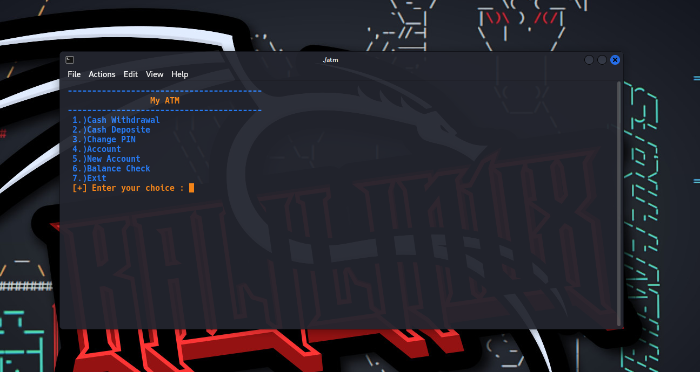

<p align=center>



<p align='center'>This Tool Developed By <br> <a herf="https://www.instagram.com/the_naresh_offcial/">@thenareshofficial</p>

## This program is used to learn how to create an ATM machine program using the C language, and you learn about how to print terminal output in colorful and about strcut.


## Installation

```console

#clone the repo
$git clone https://github.com/theNareshofficial/ATM-Machine-Program.c.git

#change Directory Bomb.py
$cd ATM-Machine-Program.c or

#compile
$gcc atm.c -o atm

#Executable file
$./atm

```


<h1 align='center'><u>ThankYou</u></h1>

